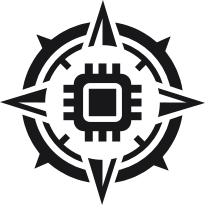

# SovereignMind – Installer

<p align="center"></p>

**On-Premise KI-Assistent für den DACH-Mittelstand.** SovereignMind ist ein DSGVO-konformer
Chat-Assistent über die eigenen Firmendokumente (RAG), der komplett lokal beim Kunden läuft.
Dokumente und Prompts verlassen das Netzwerk nicht, es gibt keine Anbindung an OpenAI, Google
oder andere Cloud-KI-APIs.

Dieses Repo enthält nur das, was für die Installation gebraucht wird (Installer-Skripte,
Compose-Dateien, Konfigurationsvorlagen). Der Quellcode ist nicht Teil davon.

Präsentation: [SovereignMind Präsentation](https://claude.ai/artifact/D8hR37cBCNKZLZEfdcZSXo) (12 Folien zu Problem, Lösung, Architektur, Funktionen, Tech-Stack und Geschäftsmodell).

## Wofür ist das gedacht?

Kanzleien, Personalabteilungen, Gesundheitswesen, Industrie: Überall liegen sensible Dokumente
(Verträge, Handbücher, Akten, Fertigungspläne), die nicht in eine US-Cloud dürfen. Ohne
freigegebene Alternative landen sie oft trotzdem in privaten ChatGPT-Accounts. SovereignMind
ist die selbst gehostete Alternative.

## Funktionen

- **Lokale KI:** Sprachmodell und Embeddings laufen auf der Hardware des Kunden (Ollama nativ
  auf dem Rechner). Das Chat-Modell wird automatisch nach
  verfügbarem VRAM gewählt (NVIDIA, AMD, sonst CPU) und kann der Admin im Bereich
  „KI-Einstellungen“ wechseln.
- **Chat mit Quellenbelegen:** Fragen in natürlicher Sprache, Antworten mit klickbaren
  Verweisen ins Originaldokument. Antworten immer auf Deutsch.
- **Dokumentenverwaltung:** PDF, DOCX, Tabellen u. a. werden automatisch geparst und
  durchsuchbar gemacht. Kategorien, Duplikaterkennung, Verarbeitungsstatus.
- **Mehrere Nutzer und Rollen:** Admin und Member, eigenes Branding pro Unternehmen.
- **Assistenten und Prompt-Bibliothek:** Vorkonfigurierte Assistenten und wiederverwendbare
  Vorlagen für das ganze Team.
- **Anbindung interner Systeme:** HTTP-Schnittstellen (DMS, ERP, Fachdatenbanken) lassen sich
  als Werkzeuge einbinden, die das Modell bei Bedarf selbst aufruft.
- **Dateien im Chat:** Dokumente direkt in einer Unterhaltung hochladen, ohne sie dauerhaft
  abzulegen.
- **Sprache:** Diktat und Vorlesen, lokal verarbeitet; der Admin schaltet beides pro
  Unternehmen frei.
- **Admin-Bereich:** Nutzer, Dokumente, Branding, Lizenz, KI-Einstellungen (Modelle, Assistenten,
  Vorlagen, Sprache), Nutzungsstatistik, Logs, Hardware-Dashboard.

## Architektur in Kürze

```
Web-Oberfläche ──> Backend (Auth, Rollen, Lizenz, Mandanten)
                      ├─ Inferenz (Ollama)
                      ├─ Vektordatenbank (Qdrant)
                      ├─ Dokumentenverarbeitung (Docling)
                      ├─ Sprache (optional)
                      └─ PostgreSQL
```

Alles läuft als Docker-Compose-Stack, mit einer Ausnahme: Ollama (Standard-Inferenz) läuft
nativ auf dem Rechner und wird vom Installer bei Bedarf mitinstalliert. Die Docker-Images liegen
in einer privaten Registry (GitHub Container Registry) und werden mit einem Zugangstoken geladen.

## Voraussetzungen

- Docker mit Compose-Plugin (Docker Desktop unter Windows und macOS)
- Internetzugang für Installation und den ersten Modell-Download (ca. 5 GB Worker-Modelle,
  zusätzlich zu den Ollama-Modellen; unter Windows lädt der
  Installer zusätzlich Ollama, ca. 1,5 GB, sofern es fehlt)
- Für gute Antwortzeiten eine GPU mit ausreichend VRAM. Ohne GPU läuft alles auf der CPU,
  deutlich langsamer. Unter Windows mit AMD-GPU kommt die GPU nur bei nativ installiertem
  Ollama zum Einsatz (in Docker-Containern läuft das Modell dort auf CPU und RAM), deshalb
  installiert der Installer Ollama direkt auf dem Rechner
- Optional, nur Windows: Administratorrechte für den Hardware-Agent (Windows-Dienst, der echte
  CPU-/RAM-/GPU-Werte fürs Hardware-Dashboard liefert; der Installer fragt danach)
- Ein Zugangstoken (siehe unten)
- Windows 10/11, Linux oder macOS

## Zugangstoken

Die Images sind nicht öffentlich. Für den Download brauchst du ein Token mit der Berechtigung
`read:packages`. Es wird dir vom Anbieter bereitgestellt, hat nur Lesezugriff auf die Images,
läuft ab und kann jederzeit widerrufen werden. Nach Ablauf bitte ein neues anfordern.

Das Token gehört dir allein. Nicht weitergeben und nicht in Repos oder Chats posten.

## Installation

Linux / macOS:

```bash
export SOVEREIGNMIND_GHCR_TOKEN=<dein-token>
curl -fsSL https://raw.githubusercontent.com/Benexdrake/sovereignmind-installer/main/install.sh | bash
```

Windows (PowerShell):

```powershell
$env:SOVEREIGNMIND_GHCR_TOKEN = "<dein-token>"
irm https://raw.githubusercontent.com/Benexdrake/sovereignmind-installer/main/install.ps1 | iex
```

Danach ist die App unter <http://localhost:3000> erreichbar. Beim ersten Aufruf leitet sie auf
`/setup` weiter, wo aus der Lizenzdatei das Unternehmen und der erste Admin angelegt werden.
Beim ersten Start werden die KI-Modelle geladen, das dauert je nach Verbindung einige Minuten.

Der Installer legt das Verzeichnis `./sovereignmind` an, lädt die Konfiguration, zieht die Images
und startet den Stack. Erneutes Ausführen aktualisiert auf die neueste Version. Vorhandene
`.env`, `config.jsonl` und `models.json` bleiben dabei unverändert.

> Hinweis: Die Aufrufe oben gelten für den Zielzustand. Solange der Installer noch nicht auf
> öffentliche Downloads umgestellt ist (siehe Plan `install-token-testzugang`), braucht er
> zusätzlich Zugriff auf das private Hauptrepo.

### Einstellungen

| Variable | Bedeutung | Standard |
|---|---|---|
| `SOVEREIGNMIND_GHCR_TOKEN` | Zugangstoken (`read:packages`) | – |
| `GITHUB_USER` | Benutzername für `docker login` (optional) | `Benexdrake` |
| `SOVEREIGNMIND_DIR` | Installationsverzeichnis | `./sovereignmind` |
| `SOVEREIGNMIND_REF` | Version (Tag oder Branch) | `main` |

Weitere Einstellungen (Ports, Impressum, Ollama, Logging) stehen mit
Erklärung in der `config.jsonl` im Installationsverzeichnis. Geheimnisse gehören in die `.env`.

## Stoppen und Updates

```bash
cd sovereignmind
docker compose down          # stoppen, Daten bleiben erhalten
docker compose down -v       # stoppen und alle Docker-Daten löschen (auch die Datenbank!)
```

Das nativ installierte Ollama und seine Modelle sind davon nicht betroffen.

Update: Installer erneut ausführen.

## Datensicherung

Die Datenbank liegt im Docker-Volume `postgres-data`, alles Übrige (Dokumente, Schlüssel, Lizenz)
im Volume `backend-data`. Datenbank und Schlüsselordner gehören zusammen: ohne die Schlüssel sind
gespeicherte Connector-Zugangsdaten unlesbar.

Datenbank und Schlüssel sichern und wiederherstellen (im Installationsverzeichnis, Stack läuft):

```bash
bash backup-db.sh                    # -> backups/<Zeitstempel>/ (sovereignmind.dump + keys/)
bash restore-db.sh backups/<Ordner>  # fragt vorher nach, überschreibt die Datenbank
```

Unter Windows: `.\backup-db.ps1` bzw. `.\restore-db.ps1 backups\<Ordner>`. Den Ordner `backups/`
geschützt aufbewahren (er enthält die Schlüssel). Dokumente sind darin nicht enthalten.

## Sicherheitshinweis

`docker login` speichert das Token je nach System im Credential-Store oder unverschlüsselt in
`~/.docker/config.json`. Auf gemeinsam genutzten Rechnern nach der Installation `docker logout
ghcr.io` ausführen.

## Hilfe

Bei Problemen mit Installation oder Token bitte beim Anbieter melden und die Ausgabe des
Installers mitschicken.
